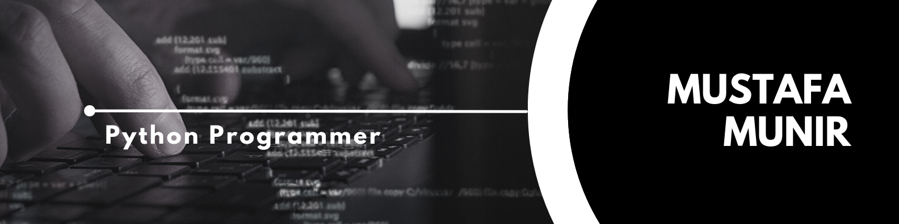

<h1>👋 Hi there, I’m Mustafa Munir</h1>

- A Computer Science Undergrad of NED University.
- 👀 I’m interested in problem Solving & Backend Development.
- 🌱 I’m currently Exploring Django 

<h2>How to reach me</h2>

 
 
 
 
<h2>Mustafa Munir's GitHub Stats</h2>

<!---
MustafaMunir123/MustafaMunir123 is a ✨ special ✨ repository because its `README.md` (this file) appears on your GitHub profile.
You can click the Preview link to take a look at your changes.
--->

     
<!--<code></code>
<!--<code></code>
